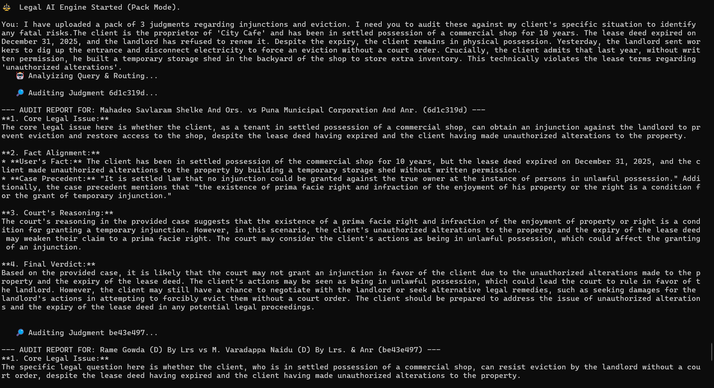

# Judicial Reasoning & Audit Engine

**A stateful reasoning engine that picks up where legal search ends — auditing precedent, aligning client facts with judicial reasoning, and pressure-testing litigation strategy, with every conclusion traceable to a judgment.**

`Status: Prototype validated on real judgment packs` · `Domain: Indian litigation (CPC), generalizes to common-law systems` · `Source code: not included — see below`

---

### ▶ Watch it work (2 min)

*Click the screenshot to watch the full demo on real judgment packs.*

---

## The problem

Legal research has solved **search**. It hasn't solved **decision-making**.

A litigator doesn't stop at retrieving 20–50 judgments — that's where the real work *starts*. They have to read each one, work out how the court aligned facts, exercised discretion, and applied doctrine, then figure out whether their own case survives that same scrutiny. This is slow, unstructured, and learned mostly by experience. Legal databases stop at search and summaries. Generic LLMs collapse all of that reasoning into a single opaque answer, with no way to check *why* it said what it said.

Nothing sits between "here are the cases" and "here's a defensible strategy." That gap is the product.

## What it does

The engine takes a trusted pack of judgments plus full client context (including the facts that hurt the case) and produces:

- **Deep factual alignment** — maps the client's specific facts onto each judgment's fact matrix, following the same fact → reasoning → conclusion flow a lawyer uses, not keyword matching
- **Precedent strength & risk auditing** — filters weak or outdated authority, flags doctrinal traps (e.g. equity bars), and ties reasoning back to statute
- **Adaptive reasoning** — reads each precedent through its own lens (a due-process case gets audited differently than an equity case), rather than asking every document the same static question
- **Stateful case workspace** — facts, risks, and open threads persist across a matter, so a refined argument is evaluated against existing context instead of starting over
- **Intent-aware defense generation** — switches from neutral audit to active strategy on request, scans the pack for what actually helps or hurts, and generates a rebuttal grounded in the surviving authority

Every output is anchored to a specific judicial passage. The engine doesn't decide the case — it makes the court's reasoning legible enough that the lawyer can.

## How it works

*Same client query, three judgments — the engine reframes the core legal issue differently for each, matching what that court actually cared about (eviction precedent → lease expiry; due-process precedent → forcible dispossession; equity precedent → unauthorized alterations).*

1. **Factual alignment** — breaks the query into its legal and factual components, grounds each fact in the court's own reasoning structure (an IRAC-style flow), and surfaces hidden doctrinal risk
2. **Strength & risk audit** — checks reliability, filters weak precedent, connects reasoning to statute, and outputs a Strategic Decision Matrix of which paths survive and which don't
3. **Adaptive framing** — adjusts what it looks for per judgment based on that precedent's own focus, instead of running one static check across everything
4. **Persistent workspace** — a matter's facts and risk triggers stay live; new arguments are tested against existing context, not from a blank slate
5. **Defense generation** — on request, switches from neutral audit to strategist mode, and builds a rebuttal from whichever precedents actually support the client

*A single client admission audited against three precedents at once — two supporting, one flagged high-risk under the "clean hands" doctrine — consolidated into one pre-filing decision matrix.*

## Scope & why it generalizes

Built first for Indian litigation under the CPC, where judicial discretion and precedent carry the most weight — a good environment to get factual alignment and doctrinal risk right at depth. The underlying engine reasons over precedent and discretion, not statute alone, so the same audit framework extends with minimal change to any common-law system — UK, US, and beyond.

## Design philosophy

Transparency over automation. The engine surfaces judicial reasoning instead of hiding it behind a single generated answer, and legal authority stays with the lawyer at every step. Search is treated as a solved, upstream problem — this starts exactly where search stops: at reasoning, risk, and strategic judgment.

## Repository contents

- 📄 **Product Memo** — full product vision, architecture, and reasoning workflow
- 🎥 **Technical demo** — the prototype running against real judgment packs ([watch here](https://go.screenpal.com/watch/cO1jo4nurcq))

This repository is documentation and demonstration material. **Source code is not included.**

## Status

Core engine functional and tested on real judgment packs. Outputs structured as reasoning audits and strategic decision matrices, purpose-built for litigation workflows rather than general legal Q&A. Currently paused to focus on other work — happy to discuss the architecture in depth.

---

Built solo, end-to-end. Reach out via [LinkedIn](https://www.linkedin.com/in/annapurna-kalmath-23a16b279/) — always glad to talk through the reasoning-audit design or where it'd need to change for a different jurisdiction.
